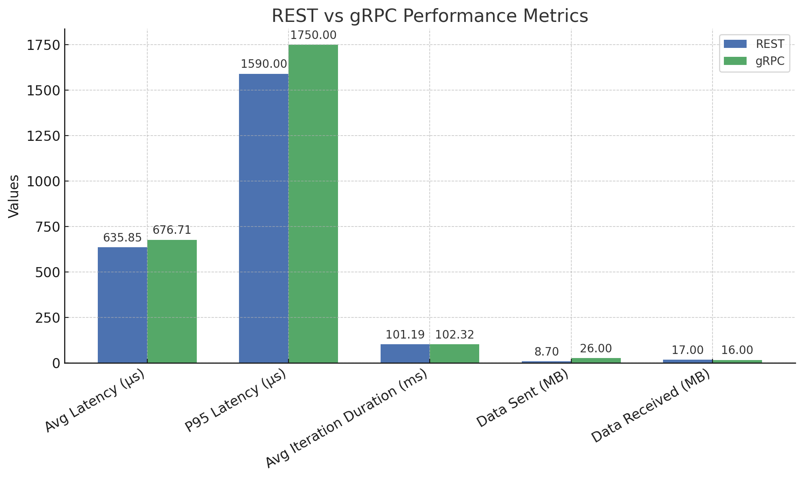

# grpc-vs-rest
A grpc-vs-rest comparison

```
go run ./rest/main.go
run test
go run ./grpc/main.go
run test
```
Use a benchmarking tool like hey (for HTTP)

## REST
```
$ hey -n 100000 -c 100 http://localhost:8888/user

Summary:
  Total:	1.7160 secs
  Slowest:	0.0140 secs
  Fastest:	0.0001 secs
  Average:	0.0017 secs
  Requests/sec:	58275.8352
  
  Total data:	6000000 bytes
  Size/request:	60 bytes

Response time histogram:
  0.000 [1]	|
  0.001 [56471]	|■■■■■■■■■■■■■■■■■■■■■■■■■■■■■■■■■■■■■■■■
  0.003 [26096]	|■■■■■■■■■■■■■■■■■■
  0.004 [10494]	|■■■■■■■
  0.006 [4441]	|■■■
  0.007 [1643]	|■
  0.008 [582]	|
  0.010 [188]	|
  0.011 [59]	|
  0.013 [11]	|
  0.014 [14]	|


Latency distribution:
  10% in 0.0003 secs
  25% in 0.0006 secs
  50% in 0.0012 secs
  75% in 0.0023 secs
  90% in 0.0037 secs
  95% in 0.0047 secs
  99% in 0.0068 secs

Details (average, fastest, slowest):
  DNS+dialup:	0.0000 secs, 0.0001 secs, 0.0140 secs
  DNS-lookup:	0.0000 secs, 0.0000 secs, 0.0020 secs
  req write:	0.0000 secs, 0.0000 secs, 0.0065 secs
  resp wait:	0.0014 secs, 0.0001 secs, 0.0130 secs
  resp read:	0.0002 secs, 0.0000 secs, 0.0091 secs

Status code distribution:
  [200]	100000 responses
```
## gRPC
```
./grpc $ ghz --insecure \
  --proto user.proto \
  --call user.UserService.GetUser \
  -c 100 -n 100000 \
  localhost:8888

Summary:
  Count:	100000
  Total:	5.10 s
  Slowest:	21.72 ms
  Fastest:	0.19 ms
  Average:	3.35 ms
  Requests/sec:	19590.53

Response time histogram:
  0.189  [1]     |
  2.343  [28158] |∎∎∎∎∎∎∎∎∎∎∎∎∎∎∎∎∎∎∎∎∎∎
  4.496  [51769] |∎∎∎∎∎∎∎∎∎∎∎∎∎∎∎∎∎∎∎∎∎∎∎∎∎∎∎∎∎∎∎∎∎∎∎∎∎∎∎∎
  6.650  [16535] |∎∎∎∎∎∎∎∎∎∎∎∎∎
  8.803  [2964]  |∎∎
  10.957 [421]   |
  13.110 [108]   |
  15.264 [34]    |
  17.417 [7]     |
  19.571 [2]     |
  21.724 [1]     |

Latency distribution:
  10 % in 1.51 ms 
  25 % in 2.21 ms 
  50 % in 3.16 ms 
  75 % in 4.21 ms 
  90 % in 5.40 ms 
  95 % in 6.24 ms 
  99 % in 8.04 ms 

Status code distribution:
  [OK]   100000 responses   
```

## Using Grafana k6 in order to have a common test tool for both protocols.

## REST
```
$ k6 run rest.js 

     execution: local
        script: rest.js
        output: -

     scenarios: (100.00%) 1 scenario, 100 max VUs, 10m30s max duration (incl. graceful stop):
              * default: 100000 iterations shared among 100 VUs (maxDuration: 10m0s, gracefulStop: 30s)

  █ TOTAL RESULTS 

    HTTP
    http_req_duration.......................................................: avg=635.85µs min=78.07µs  med=451.19µs max=9.31ms   p(90)=1.29ms   p(95)=1.59ms  
      { expected_response:true }............................................: avg=635.85µs min=78.07µs  med=451.19µs max=9.31ms   p(90)=1.29ms   p(95)=1.59ms  
    http_req_failed.........................................................: 0.00%  0 out of 100000
    http_reqs...............................................................: 100000 987.756391/s

    EXECUTION
    iteration_duration......................................................: avg=101.19ms min=100.12ms med=101.09ms max=111.21ms p(90)=102.03ms p(95)=102.48ms
    iterations..............................................................: 100000 987.756391/s
    vus.....................................................................: 100    min=100         max=100
    vus_max.................................................................: 100    min=100         max=100

    NETWORK
    data_received...........................................................: 17 MB  166 kB/s
    data_sent...............................................................: 8.7 MB 86 kB/s

running (01m41.2s), 000/100 VUs, 100000 complete and 0 interrupted iterations
default ✓ [===============] 100 VUs  01m41.2s/10m0s  100000/100000 shared iters
```
## gRPC
```
$ (main) k6 run grpc.js 

     execution: local
        script: grpc.js
        output: -

     scenarios: (100.00%) 1 scenario, 100 max VUs, 10m30s max duration (incl. graceful stop):
              * default: 100000 iterations shared among 100 VUs (maxDuration: 10m0s, gracefulStop: 30s)

  █ TOTAL RESULTS 

    checks_total.......................: 100000  976.602844/s
    checks_succeeded...................: 100.00% 100000 out of 100000
    checks_failed......................: 0.00%   0 out of 100000

    ✓ status is OK

    EXECUTION
    iteration_duration.....................: avg=102.32ms min=100.56ms med=102.03ms max=146.99ms p(90)=103.48ms p(95)=104.76ms
    iterations.............................: 100000 976.602844/s
    vus....................................: 100    min=100      max=100
    vus_max................................: 100    min=100      max=100

    NETWORK
    data_received..........................: 16 MB  159 kB/s
    data_sent..............................: 26 MB  255 kB/s

    GRPC
    grpc_req_duration......................: avg=676.71µs min=136.09µs med=462.37µs max=34.08ms  p(90)=1.28ms   p(95)=1.75ms  

running (01m42.4s), 000/100 VUs, 100000 complete and 0 interrupted iterations
default ✓ [===============] 100 VUs  01m42.4s/10m0s  100000/100000 shared iters
```
## Summary: REST vs gRPC Load Test with Grafana k6
```
Both REST and gRPC services were benchmarked using Grafana k6 under identical conditions: 100,000 iterations distributed over 100 virtual users (VUs), with each test completing in ~1m41s. Here's a breakdown of the key findings:

✅ Stability
REST: 0.00% failed requests (100% success).

gRPC: 0.00% failed requests (100% success).

Both protocols demonstrated excellent stability under load.

⚡ Latency (Request Duration)
REST http_req_duration:

Avg: 635.85µs

P95: 1.59ms

gRPC grpc_req_duration:

Avg: 676.71µs

P95: 1.75ms

Winner: REST is slightly faster on average and at the 95th percentile, though the difference is minor (<7%).

🕒 Iteration Duration
REST: Avg = 101.19ms

gRPC: Avg = 102.32ms

gRPC iterations took marginally longer, likely due to protocol overhead or larger payloads.

📦 Network Usage
REST:

Received: 17 MB

Sent: 8.7 MB

gRPC:

Received: 16 MB

Sent: 26 MB

Observation: gRPC sent significantly more data—~3x that of REST. This suggests more verbose or less compact client request payloads in the test setup.

🧾 Conclusion
Both REST and gRPC performed exceptionally well under identical heavy load conditions, with zero errors and near-identical iteration throughput. REST had slightly faster response times and more efficient data usage, while gRPC's data transmission was heavier, potentially due to richer message formats or less optimized serialization.

If minimizing latency and bandwidth is critical, REST slightly edges out. However, gRPC remains competitive and may offer stronger benefits in more complex service-to-service communication scenarios.

Would you like a visual chart comparing the metrics?
```
